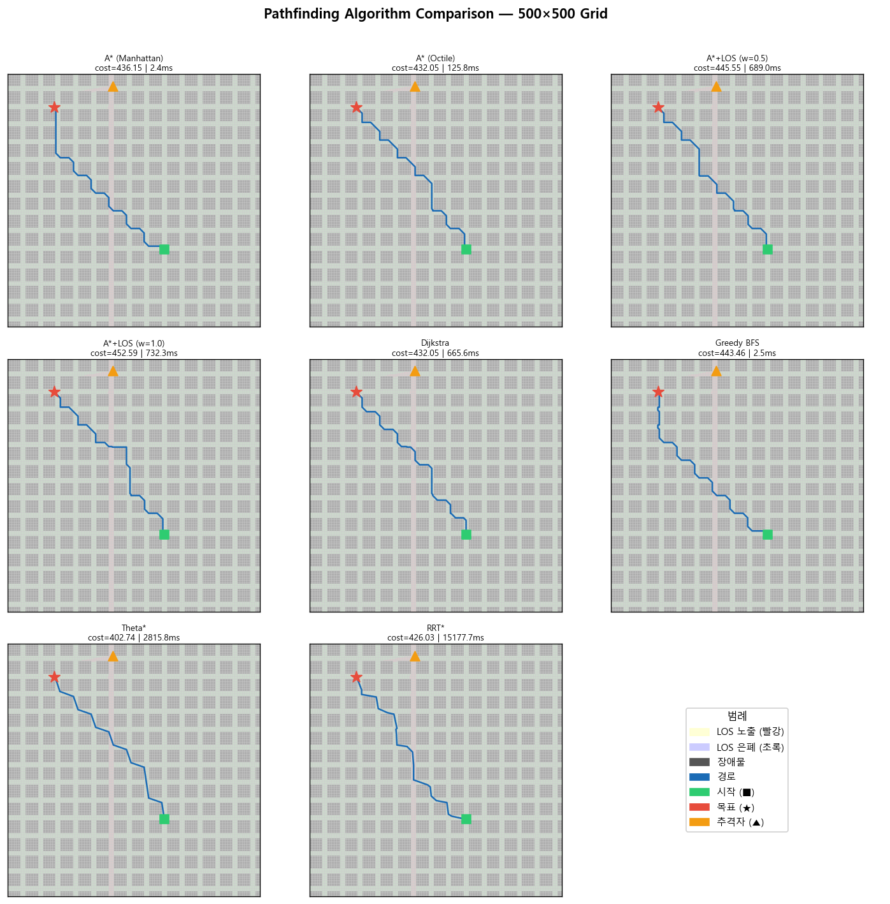
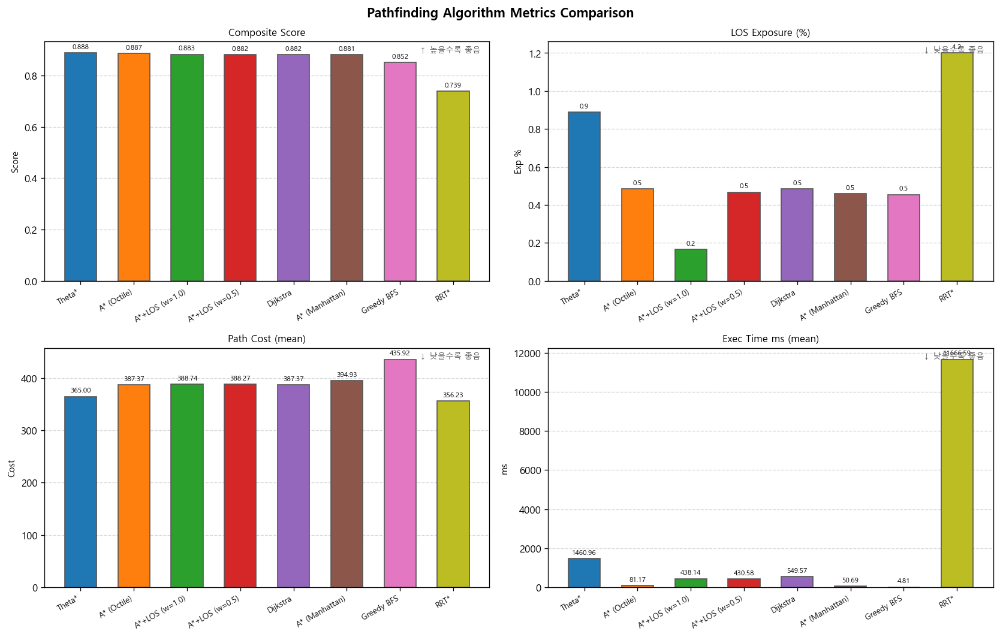

# Algorithm Analysis

Evader 회피 경로 계획 알고리즘 선정을 위한 벤치마크.
**500×500 도시 그리드**에서 8종 알고리즘을 3가지 장애물 모드로 각 5회 평가.

---

## 실험 환경

| 항목 | 값 |
|---|---|
| Grid 크기 | 500 × 500 |
| 건물 크기 (urban_block) | 25×25 셀 (gap 10셀) |
| 장애물 모드 | urban_block / random / pursuer_centered |
| Trial 수 (모드별) | 5 (시드 42~46) |
| 최소 시작-목표 거리 | Manhattan ≥ 250 (격자의 절반) |
| 알고리즘 수 | 8종 |

### 평가 지표

| 지표 | 설명 | 높을수록 좋음 |
|---|---|:---:|
| Composite Score | 가중합 종합 점수 | O |
| Success Rate | 경로 탐색 성공률 | O |
| Path Cost | 경로 유클리드 거리 합 | X |
| LOS Exposure % | 추격자 시야 노출 셀 비율 | X |
| Exec Time (ms) | 알고리즘 실행 시간 | X |

**Composite Score 공식:**
```
0.30 × (1 - norm_cost)
+ 0.25 × (1 - los_exposure/100)
+ 0.20 × (1 - norm_time)
+ 0.15 × success_rate
+ 0.10 × (1 - norm_breaks)
```

---

## 경로 시각화

동일한 500×500 도심 그리드에서 8종 알고리즘이 탐색한 경로 비교.
녹색 = LOS 은폐 구역, 적색 = LOS 노출 구역, 파란 선 = 탐색 경로.



---

## 성능 지표 비교



---

## 종합 순위 (500×500, 15 trials 기준)

| 순위 | 알고리즘 | Composite | Success | Cost (mean) | LOS Exp% (mean) | Time ms (mean) |
|:---:|---|:---:|:---:|:---:|:---:|:---:|
| 1 | **Theta\*** | **0.888** | 100% | 365.0 | 0.9% | 1,461 |
| 2 | A\* (Octile) | 0.887 | 100% | 387.4 | 0.5% | 81 |
| 3 | A\*+LOS (w=1.0) | 0.883 | 100% | 388.7 | **0.2%** | 438 |
| 4 | A\*+LOS (w=0.5) | 0.882 | 100% | 388.3 | 0.5% | 431 |
| 5 | Dijkstra | 0.882 | 100% | 387.4 | 0.5% | 550 |
| 6 | A\* (Manhattan) | 0.881 | 100% | 394.9 | 0.5% | **51** |
| 7 | Greedy BFS | 0.852 | 100% | 435.9 | 0.5% | **5** |
| 8 | RRT\* | 0.739 | 67% | 356.2 | 1.2% | 11,667 |

---

## 분석 및 결론

!!! success "추천: Theta*"
    복합 점수 0.888, 성공률 100%, LOS 노출 0.9%.
    Any-angle 경로로 도심 그리드에서 가장 자연스러운 회피 경로를 생성합니다.

!!! info "실시간 대안: A* (Octile) / A* (Manhattan)"
    A\*(Octile) 81ms, A\*(Manhattan) 51ms — Theta\*의 1/18~1/30 수준의 실행 시간.
    온라인 경로 재계획(50Hz 루프)이 필요한 실시간 환경에서 권장.

!!! tip "LOS 최소화 우선: A*+LOS (w=1.0)"
    LOS 노출 0.2%로 전체 최저. 은폐 성공이 최우선인 경우 선택.
    단, 실행 시간 438ms로 실시간 재계획보다는 미리 계획 방식에 적합.

!!! warning "RRT* 주의"
    성공률 67%로 유일하게 실패 케이스 발생. 500×500 대형 맵에서 샘플링 한계.
    연속 공간 탐색 특성 비교 참고용으로만 활용.

---

## LOS 노출이 0.2~1.2%인 이유

500×500 도시 환경에서는 건물 블록(25×25 셀)이 촘촘하게 배치되어
추격자의 시야가 좁은 도로·교차로 구간으로 제한됩니다.
경로 대부분이 건물 그림자 구역(녹색)을 통과하기 때문에 노출 비율이 자연적으로 낮습니다.
스폰 위치가 매 trial마다 달라지므로 다양한 추격자-경로 기하학이 실험됩니다.

---

## 재현 방법

```bash
git clone https://github.com/alpha7179/IIT_DroneLearning.git
pip install numpy matplotlib

python python/scripts/run_pathfinding.py \
  --grid-size 500 \
  --n-trials 5 \
  --seed 42 \
  --out python/results/pathfinding_500/
```

결과 파일: `benchmark_results.json`, `stats_summary.json`, `grid_comparison.png`, `metrics_bar.png`
