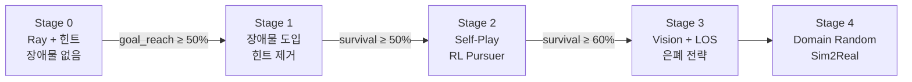

# Evader Design

담당: 이재왕 &nbsp;|&nbsp; 브랜치: `work/evader`

Evader(회피 드론)는 목표 지점에 도달하면서 Pursuer의 LOS를 차단하는 전략을 학습합니다.

---

## 제어 구조

```
RL Policy Output (4D Continuous)
    ↓
(thrust_cmd, roll_rate_cmd, pitch_rate_cmd, yaw_rate_cmd)
    ↓
PID Controller — 50Hz (World 담당)
    ↓
Rigidbody Force / Torque → 실제 비행
```

RL 정책은 직접 모터를 제어하지 않으므로 실기체 FCU와 동일한 인터페이스로 동작합니다.

---

## 행동 공간 (Action Space)

Continuous 4D:

| 인덱스 | 이름 | 범위 | 역할 |
|:---:|---|---|---|
| 0 | `thrust_cmd` | [0, 1] | 추력 명령 |
| 1 | `roll_rate_cmd` | [-1, 1] | 롤 각속도 |
| 2 | `pitch_rate_cmd` | [-1, 1] | 피치 각속도 |
| 3 | `yaw_rate_cmd` | [-1, 1] | 요 각속도 |

---

## 관측 공간 (Observation Space)

=== "Stage 0 (Ray + 힌트)"

    | 관측 항목 | 차원 | 정규화 |
    |---|:---:|---|
    | 로컬 속도 (vx, vy, vz) | 3 | / max_speed (10 m/s) |
    | 로컬 각속도 | 3 | / max_speed |
    | 고도 | 1 | / max_distance (50m) |
    | 목표 상대 방향 (normalized) | 3 | unit vector |
    | 목표 거리 | 1 | / max_distance |
    | Pursuer 상대 위치 (힌트) | 3 | / max_distance |
    | Pursuer 상대 속도 (힌트) | 3 | / max_speed |
    | Pursuer 가시 여부 | 1 | 0 or 1 |
    | Ray (Sensor 담당) | 별도 | RayPerceptionSensor |

=== "Stage 1+ (힌트 제거)"

    Pursuer 실시간 위치/속도 힌트 제거. 구조적 기억으로 대체.

    | 관측 항목 | 차원 | 설명 |
    |---|:---:|---|
    | 자기 상태 (속도+각속도+고도) | 7 | Stage 0과 동일 |
    | 목표 방향+거리 | 4 | Stage 0과 동일 |
    | 마지막 추격자 관측 위치 | 3 | 시야 차단 시 마지막 알려진 위치 |
    | 추격자 마지막 속도 | 3 | 추격자 상태 기억 |
    | 가시 여부 | 1 | 현재 LOS 여부 |

=== "Stage 2+ (Vision)"

    카메라 + LOS 역방향 raycast 추가.

    - 84×84 RGB 카메라 피드 (CNN 인코더)
    - `is_visible_to_pursuer`: Sensor 담당에서 제공하는 역방향 LOS 결과

---

## 보상 함수 설계

```python
R_total =
    # Step 보상 (EvaderReward.cs)
    + w_shaping  * (d_prev - d_now)      # potential-based 목표 거리 shaping
    + w_survival * 1                      # 생존 보너스 (+0.001/step)
    + w_occlusion * R_los                 # LOS 차단 전환 보너스 (Stage 1+)
    + w_time     * (-1)                   # 시간 패널티 (-0.001/step)

    # Terminal 보상 (EvaderAgent.cs)
    + [Goal Reached]   +1.0
    + [Captured]       -1.0
    + [Timeout]        +0.2   # 생존 부분 보상
    + [Crash]          -1.0
```

!!! warning "LOS 보너스 설계 주의"
    LOS 차단 보너스는 **전환 시 1회**만 지급합니다.
    지속 보너스(매 step)는 "건물 옆에서 제자리 회전"하는 국소 최적해를 유발합니다.

---

## Stage 기반 커리큘럼



각 Stage는 이전 Stage의 모델을 `--initialize-from`으로 초기화하여 학습 효율을 높입니다.

---

## 평가 지표 (Eval Metrics)

| 지표 | 설명 | M1 목표 |
|---|---|---|
| `survival_rate` | timeout까지 생존 비율 | **≥ 70%** |
| `goal_reach_rate` | 목표 지점 도달 비율 | **≥ 50%** |
| `capture_rate` | 포획된 에피소드 비율 | **≤ 30%** |
| `mean_time_to_capture` | 포획 시 평균 경과 시간 | 높을수록 좋음 |
| `los_break_rate` | LOS 차단 성공 비율 | Stage 2+ |

Eval은 **고정 시드 20~50 에피소드** 기준으로 실행합니다.

---

## 학습 실행

```bash
# Stage 0 학습
mlagents-learn python/config/evader_s0_template.yaml \
  --run-id=evader_s0_base_seed42 --force

# Stage 1 (Stage 0 가중치로 초기화)
mlagents-learn python/config/evader_s1_obstacle_template.yaml \
  --run-id=evader_s1_v1 \
  --initialize-from=evader_s0_base_seed42 --force

# TensorBoard 모니터링
tensorboard --logdir python/results/
```

---

## C# 구현 구조

**`EvaderAgent.cs`** — ML-Agents Agent 메인 클래스
- `CollectObservations()`: 자기 상태 7D + 목표 4D + 추격자 힌트/기억 7D
- `OnActionReceived()`: 4D 액션 → DroneController PID 호출
- `SetPursuerVisibility()`: Sensor 담당에서 LOS 결과를 에이전트에 주입

**`EvaderReward.cs`** — 보상 함수 분리 (Inspector 실시간 튜닝 가능)
- `ComputeStepReward()`: 스텝 보상 반환 (Terminal 보상 제외)
- Goal shaping coeff, Survival/Time 가중치를 Inspector에서 조정

!!! note "학습 결과"
    Stage 0 학습은 Unity 환경 구성 완료 후 시작 예정입니다.
    수렴 그래프와 Eval 결과는 업데이트 시 이 페이지에 추가됩니다.
