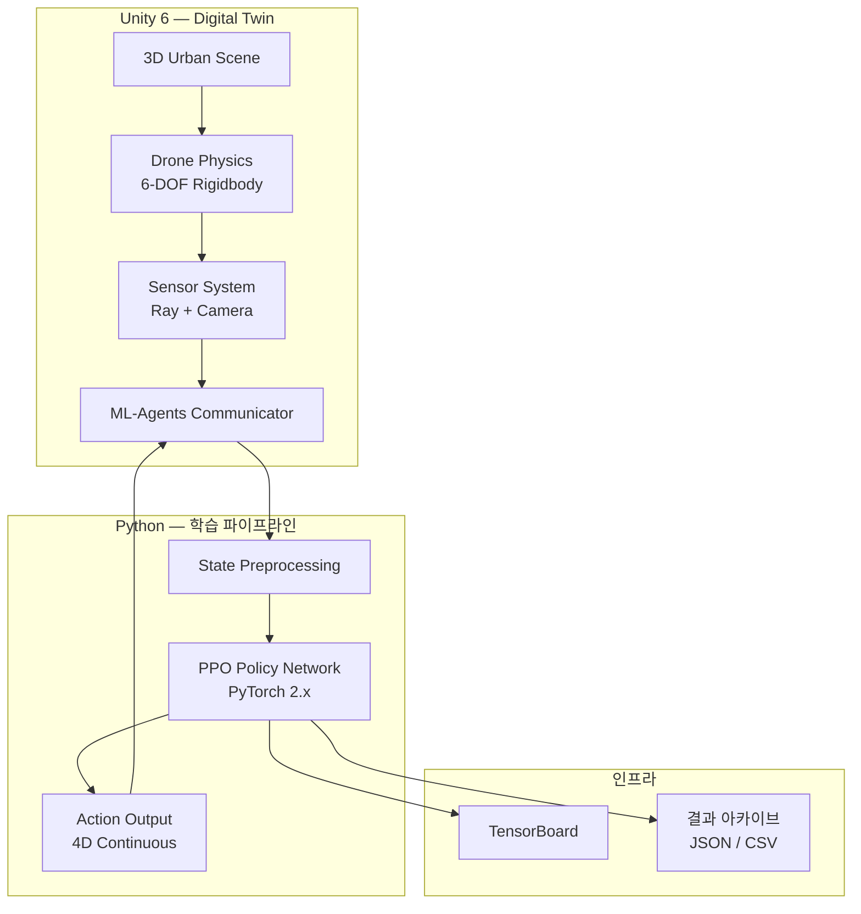
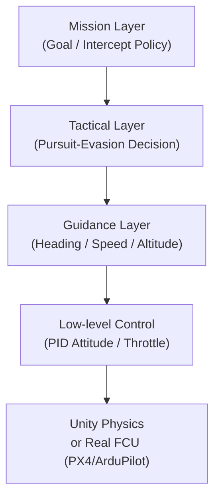

<div class="drone-split">
<div class="drone-split__media">
<svg viewBox="0 0 400 320" fill="none" xmlns="http://www.w3.org/2000/svg">
  <circle cx="200" cy="60" r="28" stroke="rgba(244,245,240,0.18)" stroke-width="1"/>
  <circle cx="80" cy="180" r="20" stroke="rgba(244,245,240,0.12)" stroke-width="1"/>
  <circle cx="200" cy="180" r="20" stroke="rgba(244,245,240,0.12)" stroke-width="1"/>
  <circle cx="320" cy="180" r="20" stroke="rgba(244,245,240,0.12)" stroke-width="1"/>
  <circle cx="120" cy="280" r="14" stroke="rgba(244,245,240,0.08)" stroke-width="1"/>
  <circle cx="200" cy="280" r="14" stroke="rgba(244,245,240,0.08)" stroke-width="1"/>
  <circle cx="280" cy="280" r="14" stroke="rgba(244,245,240,0.08)" stroke-width="1"/>
  <line x1="200" y1="88" x2="80" y2="160" stroke="rgba(244,245,240,0.08)" stroke-width="1"/>
  <line x1="200" y1="88" x2="200" y2="160" stroke="rgba(244,245,240,0.08)" stroke-width="1"/>
  <line x1="200" y1="88" x2="320" y2="160" stroke="rgba(244,245,240,0.08)" stroke-width="1"/>
  <line x1="80" y1="200" x2="120" y2="266" stroke="rgba(244,245,240,0.06)" stroke-width="1"/>
  <line x1="200" y1="200" x2="200" y2="266" stroke="rgba(244,245,240,0.06)" stroke-width="1"/>
  <line x1="320" y1="200" x2="280" y2="266" stroke="rgba(244,245,240,0.06)" stroke-width="1"/>
  <circle cx="200" cy="60" r="4" fill="rgba(244,245,240,0.5)"/>
  <circle cx="80" cy="180" r="3" fill="rgba(244,245,240,0.3)"/>
  <circle cx="200" cy="180" r="3" fill="rgba(244,245,240,0.3)"/>
  <circle cx="320" cy="180" r="3" fill="rgba(244,245,240,0.3)"/>
</svg>
</div>
<div class="drone-split__content">
  <p class="drone-badge">Architecture</p>
  <div class="drone-split__title">System Overview</div>
  <p class="drone-split__desc">Unity Digital Twin 환경과 Python 학습 파이프라인이 ML-Agents를 통해 연결되는 전체 시스템 구조와 Sim2Real 제어 계층을 설명합니다.</p>
</div>
</div>

<div class="page-body" markdown>

# System Overview

## 전체 아키텍처



---

## Sim2Real 계층형 제어 구조

RL 정책은 직접 모터를 제어하지 않습니다.
항상 PID 추상 계층을 거쳐 실기체 FCU와 동일한 인터페이스로 명령이 전달됩니다.



---

## 역할 분리 아키텍처

| 모듈 | 담당자 | 핵심 책임 |
|---|---|---|
| **World / Physics** | 이강민 | Unity 맵, 장애물, 스폰, PID 파이프라인, 에피소드 Reset |
| **Sensor / Rendering** | 배민우 | Ray 태그, 카메라, 노이즈 모델, LOS 역방향 Raycast |
| **Pursuer RL** | 박재현 | 타겟 추적·차단, LSTM 예측, Pursuer 정책 학습 |
| **Evader RL** | 이재왕 | 목표 도달 + LOS 회피, 보상 설계, 실험 분석 |

### 의존성 원칙

- `World`는 에이전트 내부 정책을 알지 못합니다.
- `Sensor`는 보상 계산 로직을 갖지 않습니다.
- `Evader`와 `Pursuer`는 공통 인터페이스(`Reset / Observe / Act / Reward`)를 공유합니다.

---

## 에피소드 인터페이스 (CONTRACT)

### 종료 조건

| 이벤트 | 조건 | 제공자 |
|---|---|---|
| Catch (포획) | 거리 < 2.0m, 3 step 연속 | World |
| Crash (추락) | altitude < 0.5m 또는 tilt > 60° | World |
| Timeout | T_max = 20s | World |
| Goal Reached | Evader ↔ Goal 거리 < 2.0m | World |
| Out-of-bounds | 맵 경계 이탈 | World |

### Reset 순서

```
World.ResetEnvironment()
  → Pursuer.OnEpisodeBegin()
  → Evader.OnEpisodeBegin()
  → Sensor.ResetBuffers()
```

### 공통 액션 공간

| 인덱스 | 이름 | 범위 |
|:---:|---|---|
| 0 | `thrust_cmd` | [0, 1] |
| 1 | `roll_rate_cmd` | [-1, 1] |
| 2 | `pitch_rate_cmd` | [-1, 1] |
| 3 | `yaw_rate_cmd` | [-1, 1] |

Physics 적용 주기: **50Hz** (FixedUpdate 0.02s), Decision Period: 5 steps

---

## 학습 시나리오 흐름

1. **환경 초기화**: 도심 맵에 Pursuer / Evader 무작위 스폰 (초기 거리 ≥ 15m)
2. **단일 에이전트 학습**: 기본 비행·목표 도달 학습 (Stage 0)
3. **장애물 도입**: 건물 환경에서 충돌 회피 + 경로 탐색 (Stage 1)
4. **경쟁 학습 (Self-Play)**: 두 에이전트가 서로의 전략을 강화 (Stage 2)
5. **Occlusion 전략**: LOS 차단 상황에서 LSTM 예측 활성화 (Stage 3)
6. **Sim2Real**: 도메인 랜덤화 후 미학습 맵 일반화 검증 (Stage 4)

!!! note "진행 상황"
    현재 Stage 0 학습 환경 준비 중입니다.
    Unity 맵 및 PID 파이프라인 구현 완료 후 학습을 시작합니다.

</div>
