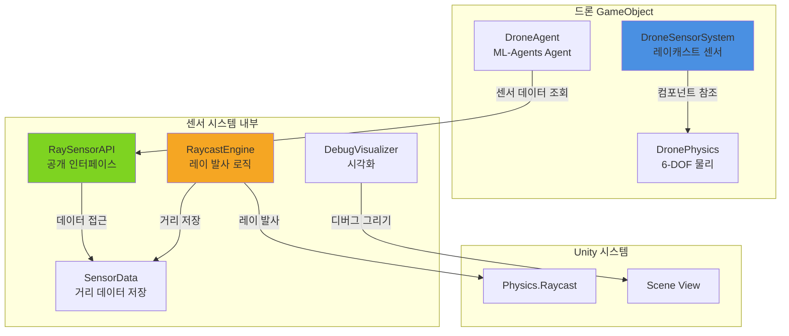

# 드론 레이 센서 시스템 설계 문서

## 개요

본 설계 문서는 Unity ML-Agents 기반 드론 시뮬레이션을 위한 26방향 레이캐스트 센서 시스템의 기술 설계를 명세합니다. 센서 시스템은 드론 중심에서 구형 패턴으로 레이를 발사하여 3차원 공간 인식을 제공하며, ML-Agents 학습을 위한 관찰 데이터로 활용됩니다.

### 설계 목표

1. **정확한 공간 인식**: 26개 방향으로 균등하게 분산된 레이를 통해 드론 주변 360도 전방위 장애물 감지
2. **깔끔한 API 설계**: 센서 데이터 접근을 위한 명확하고 사용하기 쉬운 공개 인터페이스 제공
3. **ML-Agents 통합**: 기존 DroneAgent와 원활하게 통합되어 학습 관찰 데이터로 활용
4. **성능 최적화**: 다중 드론 시뮬레이션에서도 실시간 성능 유지
5. **확장 가능한 구조**: 향후 카메라 센서 추가를 위한 모듈식 아키텍처

### 핵심 기능

- 5개 레이어(Top, Top-Middle, Middle, Middle-Bottom, Bottom)로 구성된 26방향 레이캐스트
- 드론의 회전에 따라 동적으로 변환되는 월드 공간 레이 방향
- 정규화된 거리 값(0.0~1.0) 반환으로 ML 학습 최적화
- Unity Inspector에서 설정 가능한 센서 매개변수
- Scene 뷰에서 실시간 디버그 시각화

## 아키텍처

### 시스템 구성도



### 레이어 구조

센서 시스템은 5개의 수직 레이어로 구성되며, 각 레이어는 서로 다른 고도각을 가집니다:

```
         Top (1개)
           ↑
          / \
    Top-Middle (8개)
      ↖  ↑  ↗
     ←  드론  →  Middle (8개)
      ↙  ↓  ↘
   Middle-Bottom (8개)
          \ /
           ↓
        Bottom (1개)
```

### 좌표계 및 방향 정의

- **월드 좌표계**: Unity 왼손 좌표계 (Y-up)
- **드론 로컬 좌표계**: 전방(+Z), 우측(+X), 상방(+Y)
- **수평 방위**: 8개 주방위/부방위 (N, NE, E, SE, S, SW, W, NW)
- **고도각**: 수평면(0°)을 기준으로 위쪽(+), 아래쪽(-)

### 데이터 흐름

1. **초기화 단계** (Awake/Start)
   - 레이 방향 벡터 사전 계산 및 캐싱
   - 센서 데이터 배열 할당
   - 설정 매개변수 검증

2. **업데이트 단계** (FixedUpdate)
   - 드론의 현재 Transform 기준으로 레이 방향 변환
   - 26개 레이캐스트 실행
   - 충돌 거리 정규화 및 저장

3. **조회 단계** (CollectObservations)
   - DroneAgent가 API를 통해 센서 데이터 조회
   - VectorSensor에 26개 거리 값 추가

## 컴포넌트 및 인터페이스

### DroneSensorSystem (MonoBehaviour)

드론에 부착되는 메인 센서 컴포넌트입니다.

#### 공개 속성 (Unity Inspector)

```csharp
[Header("센서 설정")]
public float MaxDetectionRange = 50f;           // 최대 감지 거리 (미터)
public float TopMiddleElevation = 45f;          // Top-Middle 레이어 고도각 (도)
public float MiddleBottomElevation = -45f;      // Middle-Bottom 레이어 고도각 (도)
public LayerMask DetectionLayerMask = -1;       // 감지 대상 레이어

[Header("디버그")]
public bool ShowDebugRays = true;               // Scene 뷰에서 레이 시각화
public Color RayHitColor = Color.red;           // 충돌 감지 시 레이 색상
public Color RayMissColor = Color.green;        // 충돌 없을 때 레이 색상
```

#### 공개 메서드 (API)

```csharp
/// <summary>
/// 모든 센서의 정규화된 거리 값을 반환합니다 (26개).
/// 반환값: 0.0 = 충돌 없음, 1.0 = 최대 범위에서 충돌
/// </summary>
public float[] GetAllNormalizedDistances();

/// <summary>
/// 특정 레이어와 방향의 정규화된 거리 값을 반환합니다.
/// </summary>
/// <param name="layer">센서 레이어 (Top, TopMiddle, Middle, MiddleBottom, Bottom)</param>
/// <param name="direction">수평 방향 (N, NE, E, SE, S, SW, W, NW) - 8방향 레이어만 해당</param>
public float GetNormalizedDistance(SensorLayer layer, CompassDirection direction);

/// <summary>
/// 최대 감지 거리를 런타임에 설정합니다.
/// </summary>
public void SetMaxDetectionRange(float range);

/// <summary>
/// 특정 레이를 활성화/비활성화합니다.
/// </summary>
public void SetRayEnabled(int rayIndex, bool enabled);

/// <summary>
/// 전방 레이 방향을 월드 공간에서 반환합니다 (카메라 정렬용).
/// </summary>
public Vector3 GetForwardRayDirection();

/// <summary>
/// 디버그 시각화를 토글합니다.
/// </summary>
public void SetDebugVisualization(bool enabled);
```

### 열거형 정의

```csharp
/// <summary>
/// 센서 레이어 정의
/// </summary>
public enum SensorLayer
{
    Top,            // 수직 위 (1개)
    TopMiddle,      // 위쪽 대각선 (8개)
    Middle,         // 수평 (8개)
    MiddleBottom,   // 아래쪽 대각선 (8개)
    Bottom          // 수직 아래 (1개)
}

/// <summary>
/// 8방위 나침반 방향
/// </summary>
public enum CompassDirection
{
    N,   // 북 (전방, 0°)
    NE,  // 북동 (45°)
    E,   // 동 (우측, 90°)
    SE,  // 남동 (135°)
    S,   // 남 (후방, 180°)
    SW,  // 남서 (225°)
    W,   // 서 (좌측, 270°)
    NW   // 북서 (315°)
}
```

### 내부 구조

#### RayConfiguration (내부 클래스)

각 레이의 설정 정보를 저장합니다.

```csharp
private class RayConfiguration
{
    public Vector3 LocalDirection;      // 드론 로컬 좌표계 방향 벡터
    public SensorLayer Layer;           // 소속 레이어
    public CompassDirection Direction;  // 수평 방향 (해당 시)
    public bool IsEnabled;              // 활성화 상태
    public int Index;                   // 배열 인덱스 (0~25)
}
```

#### SensorData (내부 구조체)

레이캐스트 결과를 저장합니다.

```csharp
private struct SensorData
{
    public float RawDistance;           // 실제 충돌 거리 (미터)
    public float NormalizedDistance;    // 정규화된 거리 (0.0~1.0)
    public bool HasHit;                 // 충돌 감지 여부
    public Vector3 HitPoint;            // 충돌 지점 (월드 좌표)
}
```

## 데이터 모델

### 레이 인덱스 매핑

26개 레이는 다음과 같이 인덱싱됩니다:

```
인덱스 0: Top (수직 위)

인덱스 1-8: Top-Middle (위쪽 대각선)
  1: N   2: NE   3: E   4: SE
  5: S   6: SW   7: W   8: NW

인덱스 9-16: Middle (수평)
  9: N   10: NE   11: E   12: SE
  13: S  14: SW   15: W  16: NW

인덱스 17-24: Middle-Bottom (아래쪽 대각선)
  17: N  18: NE  19: E  20: SE
  21: S  22: SW  23: W  24: NW

인덱스 25: Bottom (수직 아래)
```

### 레이 방향 벡터 계산

각 레이의 로컬 방향 벡터는 구면 좌표계를 사용하여 계산됩니다:

```
방위각(azimuth) = 수평 방향 각도 (0°, 45°, 90°, ..., 315°)
고도각(elevation) = 수직 각도 (-90° ~ +90°)

로컬 방향 벡터:
  x = cos(elevation) * sin(azimuth)
  y = sin(elevation)
  z = cos(elevation) * cos(azimuth)
```

#### 레이어별 고도각

- **Top**: 90° (수직 위)
- **Top-Middle**: 45° (기본값, Inspector에서 설정 가능)
- **Middle**: 0° (수평)
- **Middle-Bottom**: -45° (기본값, Inspector에서 설정 가능)
- **Bottom**: -90° (수직 아래)

#### 방위각 매핑

```
N:  0°    (전방, +Z)
NE: 45°   (전방 우측)
E:  90°   (우측, +X)
SE: 135°  (후방 우측)
S:  180°  (후방, -Z)
SW: 225°  (후방 좌측)
W:  270°  (좌측, -X)
NW: 315°  (전방 좌측)
```

### 거리 정규화 공식

```
정규화된 거리 = 실제 거리 / 최대 감지 거리

충돌 없음: 0.0
최대 범위 충돌: 1.0
중간 거리 충돌: 0.0 ~ 1.0 사이 값
```

### 레이캐스트 실행 알고리즘

```
FixedUpdate 매 프레임:
  FOR 각 레이 (i = 0 to 25):
    IF 레이가 비활성화됨:
      CONTINUE
    
    // 1. 로컬 방향을 월드 방향으로 변환
    worldDirection = transform.TransformDirection(rayConfigs[i].LocalDirection)
    
    // 2. 레이캐스트 실행
    IF Physics.Raycast(transform.position, worldDirection, out hit, MaxDetectionRange, DetectionLayerMask):
      // 충돌 감지
      sensorData[i].RawDistance = hit.distance
      sensorData[i].NormalizedDistance = hit.distance / MaxDetectionRange
      sensorData[i].HasHit = true
      sensorData[i].HitPoint = hit.point
    ELSE:
      // 충돌 없음
      sensorData[i].RawDistance = 0.0
      sensorData[i].NormalizedDistance = 0.0
      sensorData[i].HasHit = false
      sensorData[i].HitPoint = Vector3.zero
    
    // 3. 디버그 시각화 (활성화 시)
    IF ShowDebugRays:
      color = sensorData[i].HasHit ? RayHitColor : RayMissColor
      endPoint = sensorData[i].HasHit ? sensorData[i].HitPoint : (transform.position + worldDirection * MaxDetectionRange)
      Debug.DrawLine(transform.position, endPoint, color)
```

### DroneAgent 통합 예시

```csharp
public class DroneAgent : Agent
{
    private DroneSensorSystem _sensorSystem;
    
    protected override void Awake()
    {
        base.Awake();
        _sensorSystem = GetComponent<DroneSensorSystem>();
    }
    
    public override void CollectObservations(VectorSensor sensor)
    {
        // 기존 관찰 (위치, 속도, 회전, 타겟 등)
        // ... 기존 코드 ...
        
        // 센서 데이터 추가 (26개 거리 값)
        float[] distances = _sensorSystem.GetAllNormalizedDistances();
        foreach (float distance in distances)
        {
            sensor.AddObservation(distance);
        }
    }
}
```


## 정확성 속성 (Correctness Properties)

속성(Property)은 시스템의 모든 유효한 실행에서 참이어야 하는 특성 또는 동작입니다. 본질적으로 시스템이 무엇을 해야 하는지에 대한 형식적 명제입니다. 속성은 사람이 읽을 수 있는 명세와 기계가 검증할 수 있는 정확성 보장 사이의 다리 역할을 합니다.

### 속성 1: 8개 레이 레이어의 균등 분배

*임의의* 8개 레이 센서 레이어(Top-Middle, Middle, Middle-Bottom)에 대해, 각 레이의 방위각은 정확히 45도 간격으로 분배되어야 하며, 8개 방향(N, NE, E, SE, S, SW, W, NW)을 모두 포함해야 합니다.

**검증: 요구사항 1.3, 1.7**

### 속성 2: 레이어와 방향으로 거리 조회

*임의의* 유효한 센서 레이어와 나침반 방향 조합에 대해, GetNormalizedDistance(layer, direction) 메서드는 해당 레이의 정규화된 거리 값을 반환해야 하며, 이는 GetAllNormalizedDistances() 배열의 해당 인덱스 값과 일치해야 합니다.

**검증: 요구사항 2.2**

### 속성 3: 최대 감지 거리 설정 라운드트립

*임의의* 양수 거리 값에 대해, SetMaxDetectionRange(range)를 호출한 후 레이캐스트를 수행하면, 해당 범위를 초과하는 장애물은 감지되지 않아야 하며, 범위 내 장애물은 올바르게 감지되어야 합니다.

**검증: 요구사항 2.3**

### 속성 4: 레이 활성화/비활성화

*임의의* 레이 인덱스(0~25)에 대해, SetRayEnabled(index, false)를 호출하면 해당 레이는 레이캐스트를 수행하지 않아야 하며, SetRayEnabled(index, true)를 호출하면 다시 레이캐스트를 수행해야 합니다.

**검증: 요구사항 2.4**

### 속성 5: 정규화된 거리 범위

*임의의* 레이캐스트 결과에 대해, GetAllNormalizedDistances()가 반환하는 모든 거리 값은 0.0 이상 1.0 이하의 범위 내에 있어야 합니다.

**검증: 요구사항 2.6**

### 속성 6: 충돌 거리 계산 정확성

*임의의* 장애물 위치에 대해, 레이가 장애물과 충돌할 때 기록되는 거리는 드론 중심에서 충돌 지점까지의 유클리드 거리와 일치해야 합니다(부동소수점 오차 범위 내).

**검증: 요구사항 3.1**

### 속성 7: 드론 회전에 따른 레이 방향 변환

*임의의* 드론 회전(Quaternion)에 대해, 각 레이의 월드 공간 방향은 드론의 로컬 좌표계를 기준으로 올바르게 변환되어야 합니다. 즉, 드론이 회전하면 모든 레이도 함께 회전해야 합니다.

**검증: 요구사항 3.3**

### 속성 8: 레이어 마스크 필터링

*임의의* 레이어 마스크 설정에 대해, 레이캐스트는 해당 마스크에 포함된 레이어의 오브젝트만 감지해야 하며, 마스크에 포함되지 않은 레이어의 오브젝트는 무시해야 합니다.

**검증: 요구사항 5.3**

## 오류 처리

### 입력 검증

1. **최대 감지 거리**: 0 이하의 값이 설정되면 경고 로그를 출력하고 기본값(50m)으로 복원
2. **고도각 범위**: Top-Middle 고도각이 0~90도 범위를 벗어나면 경고 로그 출력 및 45도로 클램핑
3. **고도각 범위**: Middle-Bottom 고도각이 -90~0도 범위를 벗어나면 경고 로그 출력 및 -45도로 클램핑
4. **레이 인덱스**: SetRayEnabled()에 유효하지 않은 인덱스(0~25 범위 외)가 전달되면 경고 로그 출력 및 무시

### 컴포넌트 의존성

1. **Transform 누락**: Transform 컴포넌트가 없으면 초기화 실패 및 오류 로그 출력
2. **레이어 마스크 미설정**: 레이어 마스크가 Nothing으로 설정되면 경고 로그 출력 (모든 레이가 충돌 감지 불가)

### 런타임 오류

1. **레이캐스트 실패**: Physics.Raycast 호출 중 예외 발생 시 해당 레이의 거리를 0.0으로 설정하고 오류 로그 출력
2. **배열 인덱스 초과**: 내부 배열 접근 시 인덱스 범위 검증 및 예외 처리

### 로깅 전략

```csharp
// 오류 레벨
Debug.LogError($"[DroneSensorSystem] 치명적 오류: {message}");

// 경고 레벨
Debug.LogWarning($"[DroneSensorSystem] 경고: {message}");

// 정보 레벨 (디버그 빌드만)
#if UNITY_EDITOR
Debug.Log($"[DroneSensorSystem] 정보: {message}");
#endif
```

## 테스트 전략

### 이중 테스트 접근법

센서 시스템의 정확성을 보장하기 위해 단위 테스트와 속성 기반 테스트를 모두 사용합니다:

- **단위 테스트**: 특정 예제, 엣지 케이스, 오류 조건 검증
- **속성 테스트**: 모든 입력에 대한 보편적 속성 검증

두 접근법은 상호 보완적이며 포괄적인 커버리지를 제공합니다. 단위 테스트는 구체적인 버그를 잡아내고, 속성 테스트는 일반적인 정확성을 검증합니다.

### 속성 기반 테스트 설정

**테스트 라이브러리**: Unity Test Framework + NUnit (C#의 경우 FsCheck 또는 수동 랜덤 생성)

**테스트 설정**:
- 각 속성 테스트는 최소 100회 반복 실행
- 각 테스트는 설계 문서의 속성을 참조하는 주석 포함
- 태그 형식: `// Feature: drone-ray-sensor-system, Property {번호}: {속성 텍스트}`

**속성 테스트 예시**:

```csharp
[Test]
public void Property5_NormalizedDistanceRange()
{
    // Feature: drone-ray-sensor-system, Property 5: 정규화된 거리 범위
    // 임의의 레이캐스트 결과에 대해, 모든 거리 값은 0.0~1.0 범위 내에 있어야 함
    
    for (int iteration = 0; iteration < 100; iteration++)
    {
        // 랜덤 장애물 배치
        Vector3 randomObstaclePos = new Vector3(
            Random.Range(-20f, 20f),
            Random.Range(0f, 10f),
            Random.Range(-20f, 20f)
        );
        
        // 센서 업데이트
        sensorSystem.PerformRaycast();
        
        // 모든 거리 값 검증
        float[] distances = sensorSystem.GetAllNormalizedDistances();
        foreach (float distance in distances)
        {
            Assert.GreaterOrEqual(distance, 0.0f);
            Assert.LessOrEqual(distance, 1.0f);
        }
    }
}
```

### 단위 테스트 범위

**구성 테스트**:
- 26개 레이 생성 검증 (요구사항 1.1)
- 레이어별 레이 개수 검증 (요구사항 1.2)
- Top 레이 방향 검증 (요구사항 1.4)
- Bottom 레이 방향 검증 (요구사항 1.5)

**API 테스트**:
- GetAllNormalizedDistances() 배열 크기 검증 (요구사항 2.1)
- 충돌 없을 때 거리 0.0 반환 검증 (요구사항 3.2)
- 자기 자신 콜라이더 무시 검증 (요구사항 3.5)
- 가장 가까운 장애물만 감지 검증 (요구사항 3.6)

**통합 테스트**:
- MonoBehaviour 컴포넌트 부착 검증 (요구사항 4.1)
- VectorSensor 호환성 검증 (요구사항 4.2)
- 초기화 타이밍 검증 (요구사항 4.5)
- 다중 컴포넌트 호환성 검증 (요구사항 7.3)

**설정 테스트**:
- 기본 최대 감지 거리 50m 검증 (요구사항 5.1)
- 고도각 매개변수 노출 검증 (요구사항 5.2)
- 디버그 시각화 비활성화 시 그리기 작업 없음 검증 (요구사항 6.4)
- 전방 레이 방향 조회 메서드 검증 (요구사항 7.2)

**엣지 케이스 테스트**:
- Top-Middle 고도각 범위 (30~60도) 경계 검증 (요구사항 1.6)
- Middle-Bottom 고도각 범위 (-30~-60도) 경계 검증 (요구사항 1.8)
- 최대 감지 거리 경계에서의 충돌 감지
- 레이어 마스크 Nothing 설정 시 동작

### 테스트 환경 설정

**Unity 테스트 씬 구성**:
1. 빈 GameObject에 DroneSensorSystem 컴포넌트 부착
2. 테스트용 장애물 오브젝트 (Cube, Sphere 등)
3. 다양한 레이어 설정 (Default, Obstacle, Ignore 등)

**모의 객체(Mock)**:
- DroneAgent 모의 객체 (센서 데이터 조회 테스트용)
- DronePhysics 모의 객체 (통합 테스트용)

### 성능 테스트

속성 기반 테스트와 별도로 성능 벤치마크를 수행합니다:

1. **단일 드론 성능**: 26개 레이캐스트 실행 시간 측정 (목표: < 1ms)
2. **다중 드론 성능**: 10개 드론 동시 실행 시 프레임률 측정 (목표: > 60 FPS)
3. **메모리 할당**: 프로파일러로 가비지 컬렉션 발생 빈도 측정 (목표: 0 할당/프레임)

### 지속적 통합

- 모든 테스트는 코드 변경 시 자동 실행
- 속성 테스트 실패 시 실패한 입력 값 로깅
- 테스트 커버리지 목표: 90% 이상 (공개 API 기준)

