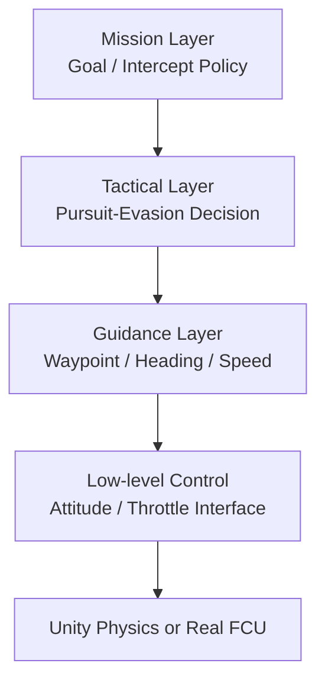

# IIT DroneLearning Implementation Blueprint

연구 소개 문서가 아니라, 실제 개발/학습을 진행하기 위한 구현 기준 문서입니다.

## 1. Scope
- 목표: 도심 Occlusion 환경에서 Pursuer(추적) vs Evader(회피) 경쟁 학습을 Sim2Real 전제를 두고 구현한다.
- 산출물: Unity 실행 환경, 학습 가능한 Agent 구성, Stage별 모델 체크포인트, 실기체 이식 가능한 제어 인터페이스.

## 2. Version Lock (필수)
- Unity: `6.0.57f1`
- ML-Agents: `4.0.x`
- Python: `3.10` 권장
- PyTorch: `2.x`
- OS: Ubuntu(Colab), macOS/Windows(로컬 개발)

버전 불일치 시 재현성보다 마이그레이션 비용이 먼저 발생하므로 위 버전을 기준선으로 유지한다.

## 3. Sim2Real 계층형 제어 구조



- `Mission Layer`: 도달/차단 목표 결정, episode 단위 전략 선택.
- `Tactical Layer`: 가시성/가림 상태에서 추적 또는 회피 전술 선택.
- `Guidance Layer`: 정책 출력을 기체 친화적 명령(`desired_heading`, `desired_speed`, `desired_altitude`)으로 변환.
- `Low-level Control`: Unity 물리 또는 실제 FCU(PX4/ArduPilot)에 전달 가능한 제어 신호로 매핑.

Sim2Real 핵심 원칙:
- 정책이 직접 모터 명령을 내리지 않도록 하고, 항상 `Guidance` 추상 계층을 거친다.
- 관측/행동 스케일을 실기체 범위와 동일하게 정규화한다.
- 학습 중 노이즈/지연/드랍아웃을 단계적으로 주입한다.

## 4. 역할 분리 아키텍처 (필수)

### 4.1 World
- 책임: 맵, 장애물, 스폰, 충돌, 에피소드 리셋, 시간/날씨 파라미터.
- 입력: Stage 설정값(맵 seed, randomization 강도).
- 출력: 전역 상태, episode 종료 조건.

### 4.2 Sensor
- 책임: Ray, Vision, 상태 추출, 노이즈 모델, 관측 버퍼링.
- 입력: World 상태 + Agent pose.
- 출력: Agent별 observation tensor.

### 4.3 Evader
- 책임: 목표 지점 도달 + Pursuer LOS(Line-of-Sight) 회피.
- 입력: 로컬 관측 + (설정 시) 전역 힌트.
- 출력: 회피 행동(action), 보상 로그.

### 4.4 Pursuer
- 책임: 타겟 탐지/추적/차단, Occlusion 중 예측 추적.
- 입력: 로컬 관측 + 메모리 상태(LSTM stage).
- 출력: 추적 행동(action), 보상 로그.

의존성 규칙:
- `World`는 Agent 정책 내부를 몰라야 한다.
- `Sensor`는 보상 계산 로직을 갖지 않는다.
- `Evader`와 `Pursuer`는 공통 인터페이스(`Reset`, `Observe`, `Act`, `Reward`)를 공유한다.

## 5. Stage 기반 학습 전략

순서 고정: `Ray -> Vision -> LSTM -> Domain Randomization`

### Stage 1: Ray (기초 기동)
- 목적: 충돌 회피, 목표 접근/이탈의 기본 제어 안정화.
- 관측: Raycast + 기초 상태(속도, heading error, 거리).
- 종료 기준:
  - 학습 곡선 변동폭 안정화
  - 충돌률 임계치 이하(팀 기준값 설정)

### Stage 2: Vision (시각 인식 결합)
- 목적: RGB 기반 타겟 인지 + Ray 정책 결합.
- 관측: Camera encoder 출력 + Stage1 피처.
- 방식: Stage1 체크포인트 warm-start.
- 종료 기준:
  - 타겟 재획득률 상승
  - 가시 영역 내 추적 성공률 향상

### Stage 3: LSTM (Occlusion 대응)
- 목적: 타겟 비가시 구간에서 단기 궤적 기억으로 재탐지 성능 향상.
- 관측: Vision 피처 시퀀스 + 내부 메모리.
- 방식: truncated BPTT, sequence length 고정.
- 종료 기준:
  - Occlusion 구간 평균 손실시간 감소
  - 재포착 시간 단축

### Stage 4: Domain Randomization (Sim2Real 일반화)
- 목적: 실환경 편차에 대한 강건성 확보.
- 랜덤화 대상:
  - 센서 노이즈/지연
  - 조명/안개/텍스처
  - 질량/항력/풍향
  - 카메라 FOV/왜곡
- 종료 기준:
  - Unseen seed/map에서 성능 하락폭 허용 범위 내 유지

## 6. Colab Pro+ 학습 파이프라인

### 6.1 운영 원칙
- 대규모 학습은 `Colab Pro+`에서 실행, Unity 시뮬레이터는 빌드 실행본(헤드리스) 사용.
- 체크포인트/로그는 Drive에 저장하고 로컬 저장소와 분리 관리.

### 6.2 표준 폴더(권장)
```text
workspace/
  configs/
  runs/
  checkpoints/
  exports/
```

### 6.3 기본 실행 순서
```bash
# 1) 환경 준비
pip install -U pip
pip install mlagents==4.0.* torch tensorboard

# 2) 학습 실행 (예: Stage 1)
mlagents-learn configs/stage1_ray.yaml --run-id=stage1_ray_v1 --force

# 3) Stage 전환 시 초기화 가중치 사용
mlagents-learn configs/stage2_vision.yaml --run-id=stage2_vision_v1 --initialize-from=stage1_ray_v1 --force

# 4) 로그 확인
tensorboard --logdir runs
```

### 6.4 체크포인트 관리 규칙
- `best`, `last`, `milestone`를 분리 저장.
- Stage 완료 시 ONNX export 후 다음 Stage 입력으로 고정.
- 실험 이름에 Stage/seed/맵 버전 포함 (`s3_lstm_seed03_mapv2`).

## 7. 구현 체크리스트

### 7.1 Unity 측
- [ ] `World`, `Sensor`, `Evader`, `Pursuer` MonoBehaviour/Agent 분리
- [ ] 학습/평가 모드 분기 (`train`, `eval`)
- [ ] 결정 주기(decision period)와 물리 tick 명시
- [ ] episode reset 시 동기화 순서 고정

### 7.2 학습 측
- [ ] Stage별 YAML 분리
- [ ] 보상 항목을 공통 템플릿으로 관리
- [ ] seed 고정 실험 + 랜덤 seed 실험 분리
- [ ] TensorBoard 지표 표준화(성공률, 충돌률, 평균 추적시간)

### 7.3 Sim2Real 측
- [ ] Guidance 인터페이스 출력 단위 표준화
- [ ] 제어 지연/센서 지연 시뮬레이션 옵션화
- [ ] 실기체 입력 한계(속도/가속/회전율)로 action clipping

## 8. 최소 운영 플로우
1. Unity에서 Stage1 학습 맵 검증.
2. Colab Pro+에서 Stage1 학습 후 체크포인트 고정.
3. Stage2/3를 warm-start로 확장.
4. Stage4에서 랜덤화 강도 점진 증가.
5. Unseen 맵 평가 후 Sim2Real 파라미터 튜닝.

## 9. 문서 사용 규칙
- 이 README는 "운영 기준" 문서다.
- 새로운 아이디어는 먼저 이 문서의 Stage/역할/버전 기준과 충돌 여부를 확인한 뒤 반영한다.
- 이론/배경 설명은 별도 문서로 분리하고, README에는 실행 기준만 유지한다.
