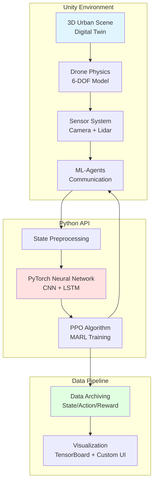

# **도심지 가림(Occlusion) 환경 극복을 위한 정보 비대칭 기반의 드론 추적 회피 경쟁적 강화 학습(MARL) 시스템 개발**

## **1. 프로젝트 개요 (Project Overview)**

도심 환경에서 드론의 활용이 급증함에 따라 불법 촬영, 시설 정찰, 항공 안전 위협 등의 부작용도 함께 증가하고 있습니다. 기존 안티 드론 기술은 고가의 레이더 장비나 전파교란 장치에 의존하며, 비용과 법적 제약으로 인해 민간 영역이나 연구·교육 환경에서 접근하기 어렵습니다.

본 프로젝트는 **Digital Twin** 기반의 고충실도 시뮬레이션 환경에서 추적(Tracker)과 회피(Evader) 드론이 **정보 비대칭(Information Asymmetry)** 구조 하에 경쟁적으로 학습하는 **다중 에이전트 강화학습(MARL)** 시스템을 구축합니다. 특히 도심지 건물로 인한 **가림 현상(Occlusion)**을 핵심 제약으로 설정하여, 현실적인 자율 비행 의사결정 전략을 검증합니다.

### **1.1. 주요 특징 및 기대효과**

* **주요 특징**
    * **Digital Twin 기반 도시 환경:** 실제 도시 구조를 반영한 고충실도 3D 가상 환경으로 건물, 골목, 고도 차이 등 복잡한 도심 지형을 정밀하게 재현합니다.
    * **정보 비대칭 구조:** 추적 드론은 제한된 시야(Local Observation)만 활용하고, 회피 드론은 전역 지도(Global Map)를 활용하여 현실적인 정보 격차를 구현합니다.
    * **가림 현상(Occlusion) 극복:** 건물로 인해 타겟이 시야에서 사라지는 상황에서 LSTM 기반 예측 모델을 통해 과거 이동 궤적을 기억하고 위치를 예측합니다.
    * **경쟁적 학습(Self-Play):** 추적과 회피 드론이 상호작용하며 점진적으로 전략을 고도화하는 커리큘럼 학습(Curriculum Learning)을 적용합니다.
    * **Sim2Real 검증:** 시뮬레이션 결과를 실제 드론 제어 명령(속도, 방향, 고도)으로 변환 가능한 인터페이스를 구축하여 현실 적용 가능성을 검증합니다.

* **기대 효과**
    * 고가의 하드웨어 없이 안전한 시뮬레이션 환경에서 반복 실험을 통한 자율 비행 전략 검증.
    * 도심지 특화 드론 추적·회피 시스템 개발을 위한 연구 기반 마련.
    * 강화학습 기반 자율 비행 시스템의 Sim2Real 전환 가능성 제시.
    * 다중 에이전트 강화학습(MARL) 연구 및 교육용 오픈소스 플랫폼 제공.

### **1.2. 차별성 (Differentiation)**

기존 연구들은 주로 **개활지(Open Space)** 환경이나 **완전 관측(Full Observability)** 조건을 가정합니다. 본 프로젝트는:

| 기존 연구 | 본 프로젝트 (IIT) |
|---------|-----------------|
| 장애물 없는 개활지 | 고밀도 도심 환경 (건물, 골목) |
| 타겟 위치 항상 공유 | 정보 비대칭 (제한된 시야 vs 전역 지도) |
| 단순 추격 시나리오 | 목적지 도달 + 차단 전술 시나리오 |
| 시각적 시뮬레이션 | Sim2Real 검증 가능한 제어 인터페이스 |
| 단일 프레임 기반 인식 | LSTM 기반 시계열 예측 및 대상 영속성 |

## **2. 시스템 구조 (System Architecture)**

### **2.1. 전체 아키텍처**



### **2.2. 핵심 기능 (Key Features)**

* **1. Predictive Tracking (LSTM 기반 예측형 추적)**
    * **대상 영속성(Object Permanence):** 타겟이 건물 뒤로 사라져도 과거 이동 궤적을 기억하여 위치를 예측합니다.
    * **LSTM 네트워크:** 시계열 데이터 처리를 통해 타겟의 다음 위치를 예측하고 선제적으로 이동합니다.
    * **지능형 수색(Search):** 가림 발생 시 마지막 관측 위치와 이동 방향을 바탕으로 최적 수색 경로를 계획합니다.

* **2. Strategic Evasion (전략적 회피)**
    * **장애물 활용:** 건물과 골목을 이용한 은폐 전략으로 추적자의 시야에서 벗어납니다.
    * **목적지 도달:** 추적자의 차단 전 목표 지점(Goal Zone)에 도착하는 임무를 수행합니다.
    * **전역 지도 활용:** Global Map 정보를 활용하여 최적 회피 경로를 탐색합니다.

* **3. Photorealistic Environment (Digital Twin)**
    * **고충실도 3D 도시:** 실제 도시 구조를 반영한 가상 환경 (건물 높이, 골목 폭 다양화).
    * **물리 기반 렌더링(PBR):** 실감미디어 기술을 적용한 사실적인 시각 표현.
    * **센서 시뮬레이션:** 카메라(RGB) + Lidar(Ray Casting) 모사 및 센서 노이즈 반영.
    * **환경 변수:** 조도, 날씨, 렌즈 왜곡, 모션 블러 등 현실적 제약 반영.

* **4. Data Pipeline & Visualization**
    * **데이터 아카이빙:** 에이전트 상태(State), 행동(Action), 보상(Reward) 로그를 체계적으로 저장.
    * **실시간 시각화:** 학습 곡선, 성공률, 텔레메트리 정보를 그래프로 표시.
    * **재현(Replay):** 저장된 데이터를 3D 공간에서 재생하여 행동 패턴 분석.

### **2.3. 학습 시나리오 플로우**

1. **환경 초기화:** 도심 맵에 추적 드론과 회피 드론을 무작위 위치에 스폰.
2. **Phase 1 - 단일 에이전트 학습:** 각 드론이 독립적으로 기본 행동 패턴 학습 (추적/회피).
3. **Phase 2 - 경쟁 학습(Self-Play):** 두 드론이 동시에 학습하며 상호작용을 통해 전략 고도화.
4. **Phase 3 - 가림 상황 대응:** 건물로 인한 시야 차단 시 LSTM 기반 예측 모델 활성화.
5. **Phase 4 - 일반화 검증:** 학습하지 않은 새로운 맵(Unseen Map)에서 성능 테스트.
6. **결과 평가:** 추적 성공률, 회피 성공률, 평균 포획 시간 등 정량 지표 분석.

## **3. 팀원 (Team Members)**

|이름|학과|학번|역할|Mobile|e-mail|GitHub|
|---|---|---|---|---|---|---|
|이강민|디지털미디어학과|202127163|**드론 동역학 및 물리 엔진 구현**<br/>- 6-DOF 비행 제어기 개발<br/>- Unity 물리 엔진 최적화|010-2303-3064|jerry3708@ajou.ac.kr|[https://github.com/grace-mi71](https://github.com/grace-mi71)|
|배민우|디지털미디어학과|202221046|**도시 환경 구축 및 센서 시각화**<br/>- Digital Twin 레벨 디자인<br/>- 센서 렌더링 파이프라인 개발|010-4189-7179|alpha7179@ajou.ac.kr|[https://github.com/alpha7179](https://github.com/alpha7179)|
|박재현|소프트웨어학과|202220741|**추격자(Tracker) AI 로직 및 학습**<br/>- LSTM 기반 예측 모델 설계<br/>- PPO 학습 파이프라인 구축|010-6887-7568|jaehyun03@ajou.ac.kr|[https://github.com/jhparktime](https://github.com/jhparktime)|
|이재왕|소프트웨어학과|202220708|**회피자(Evader) AI 로직 및 실험 분석**<br/>- 회피 전략 보상 함수 설계<br/>- 실험 결과 정량 분석|010-9548-1535|jaewang1535@ajou.ac.kr|[https://github.com/zaeee-wang](https://github.com/zaeee-wang)|

## **4. 기술 스택 (Tech Stack)**

* **Engine:** Unity 6000.0.x
* **Language:** C# 10.0, Python 3.9+
* **Framework:** Unity ML-Agents 3.0+
* **Deep Learning:** PyTorch 2.0+
* **Algorithm:** PPO (Proximal Policy Optimization), LSTM (Long Short-Term Memory)
* **Visualization:** TensorBoard, Matplotlib, Plotly
* **Version Control:** Git, GitHub

## **5. 공유 문서 (Shared Documents)**

* **Notion**
    * 프로젝트 기획서: [링크 추가 예정]
    * 주간 회의록: [링크 추가 예정]
* **GitHub**
    * Repository: [링크 추가 예정]
* **Google Drive**
    * 실험 결과 데이터: [링크 추가 예정]

## **6. 개발 규칙 (Development Convention)**

### **6.1. 커밋 메시지**

* **커밋 메시지:** `[태그] 내용` 형식으로 작성합니다.

| 태그       | 설명                             |
| ---------- | -------------------------------- |
| `[Feat]`   | 새로운 기능 구현                 |
| `[Add]`    | Feat 이외의 코드, 라이브러리, 에셋 등 추가 |
| `[Update]` | 기존 기능 및 요소 강화           |
| `[Change]` | 기존 기능 및 요소 단순 변경           |
| `[Fix]`    | 버그 및 오류 해결                |
| `[Remove]` | 파일 및 리소스 삭제              |
| `[Refactor]` | 코드 구조 개선 (기능 변경 없음)    |
| `[Design]` | UI/UX 및 모델링 디자인 수정      |
| `[Comment]`| 주석 추가 및 수정                |
| `[Setting]`| Unity 및 ML-Agents 프로젝트 설정           |
| `[Docs]`   | 문서 작성 및 수정                |

### **6.2. 폴더 구조**

* **Unity 프로젝트 (IIT_DroneLearning/Assets)**
    * Assets 폴더 내에 각자 `이니셜(PascalCase)` 폴더를 생성하여 작업합니다.
    * 개인 폴더 내부는 `Scripts`, `Scenes`, `Prefabs`, `Materials` 등으로 다시 분류합니다.

* **Python 프로젝트**
    ```
    python/
    ├── config/          # ML-Agents 학습 설정 파일
    ├── models/          # 학습된 모델 (.onnx, .pt)
    ├── scripts/         # 학습 및 추론 스크립트
    ├── utils/           # 데이터 처리 유틸리티
    └── results/         # 실험 결과 로그
    ```

### **6.3. 스크립팅 (C# - Unity)**

* **변수명**
    * `public` 멤버: PascalCase (예: `public int DroneSpeed;`)
    * `private`, `protected` 멤버: _camelCase (예: `private int _droneSpeed;`)
    * `bool` 변수: Is~, Can~ 등의 질문형 (예: `isTracking`, `canEvade`)
    * `const` 변수: 대문자와 언더바 사용 (예: `MAX_DRONE_COUNT`)

* **함수명**
    * 일반 함수: PascalCase (예: `StartTracking();`)
    * `bool` 반환 함수: 질문형 (예: `IsTargetVisible();`)
    * 이벤트 핸들러/콜백: On으로 시작 (예: `OnTargetLost()`)

### **6.4. 스크립팅 (Python - ML-Agents)**

* **변수명**
    * 일반 변수: snake_case (예: `drone_position`, `target_distance`)
    * 상수: 대문자와 언더바 (예: `MAX_EPISODE_LENGTH`)
    * 클래스명: PascalCase (예: `TrackerAgent`, `EvaderAgent`)

* **함수명**
    * 일반 함수: snake_case (예: `calculate_reward()`, `preprocess_state()`)
    * Private 함수: _로 시작 (예: `_update_lstm_state()`)

## **7. 설치 및 실행 (Installation & Usage)**

### **7.1. Prerequisites**

```bash
# Unity 6000.0.x 이상 설치 필요
# Python 3.9 이상 설치 필요

# Python 가상환경 생성 (권장)
python -m venv venv
source venv/bin/activate  # Windows: venv\Scripts\activate
```

### **7.2. Installation**

```bash
# 1. 레포지토리 클론
git clone https://github.com/your-team/IIT-DroneLearning.git
cd IIT-DroneLearning

# 2. Python 의존성 설치
pip install -r requirements.txt

# 3. Unity ML-Agents 설치
pip install mlagents==3.0.0
```

### **7.3. Training**

```bash
# 추적자(Tracker) 드론 학습
mlagents-learn config/tracker_config.yaml --run-id=tracker_v1

# 회피자(Evader) 드론 학습
mlagents-learn config/evader_config.yaml --run-id=evader_v1

# 경쟁 학습(Self-Play)
mlagents-learn config/marl_config.yaml --run-id=marl_v1
```

### **7.4. Inference**

```bash
# 학습된 모델로 시뮬레이션 실행
python inference.py --model results/tracker_v1.onnx --env urban_scene_01
```

## **8. 개발 로드맵 (Roadmap)**

### **Phase 1: 환경 구축 (Week 1-3)**
- [ ] Unity 기반 시뮬레이션 아키텍처 설계
- [ ] 도심지 3D 환경 프로토타입 제작
- [ ] 드론 물리 모델 (6-DOF) 구현
- [ ] ML-Agents 통신 인터페이스 연결

### **Phase 2: 단일 에이전트 학습 (Week 4-7)**
- [ ] 센서 입력 구조 설계 (Camera + Lidar)
- [ ] 보상 함수(Reward Function) 설계
- [ ] 추적/회피 드론 독립 학습
- [ ] 기본 행동 패턴 확보

### **Phase 3: MARL & 경쟁 학습 (Week 8-11)**
- [ ] 다중 에이전트 환경 구성
- [ ] Self-Play 학습 파이프라인 구축
- [ ] LSTM 기반 예측 모델 통합
- [ ] 정보 비대칭 구조 검증

### **Phase 4: Sim2Real & 검증 (Week 12-16)**
- [ ] 제어 인터페이스 매핑 (Unity → Real Drone)
- [ ] 일반화 성능 테스트 (Unseen Map)
- [ ] 정량 지표 분석 (성공률, 포획 시간)
- [ ] 최종 보고서 및 코드 공개

## **9. 참고 문헌 (References)**

본 프로젝트는 다음 연구들을 참고하여 설계되었습니다:


**지도교수:** 정소이 교수님 (미래모빌리티공학과)

## **11. 라이선스 (License)**

This project is licensed under the MIT License - see the [LICENSE](LICENSE) file for details.

---

*Bridging Simulation and Reality through Intelligent Multi-Agent Systems*
